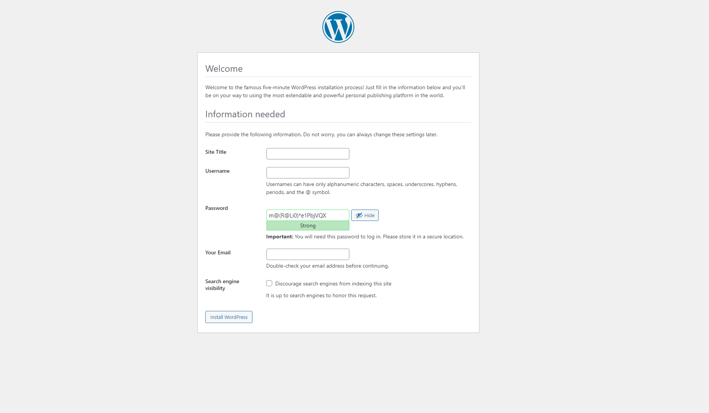
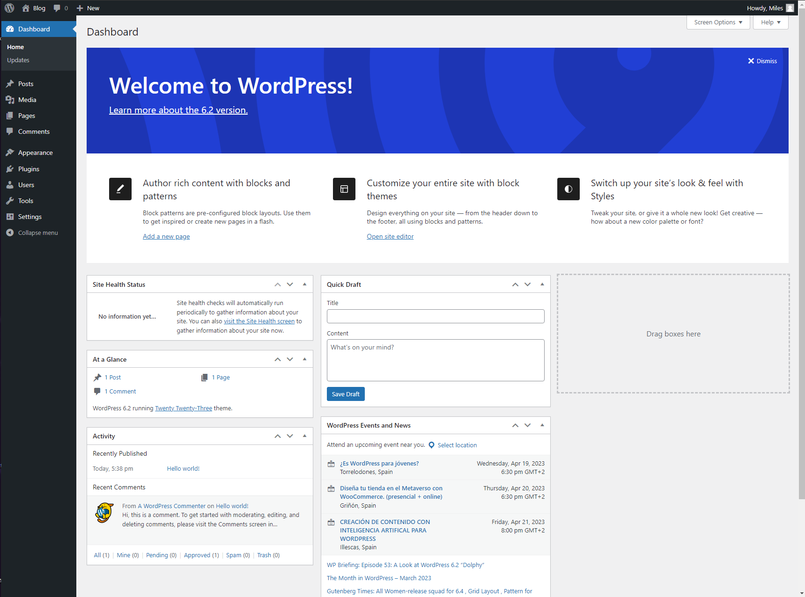
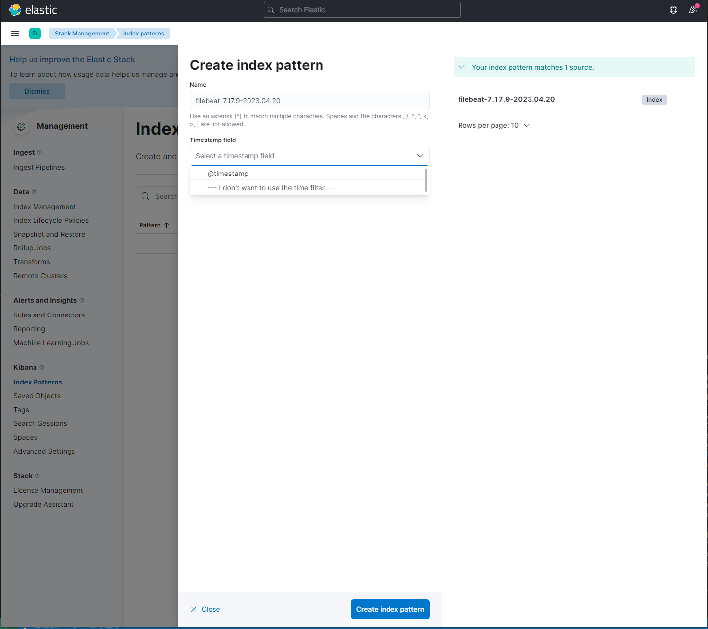
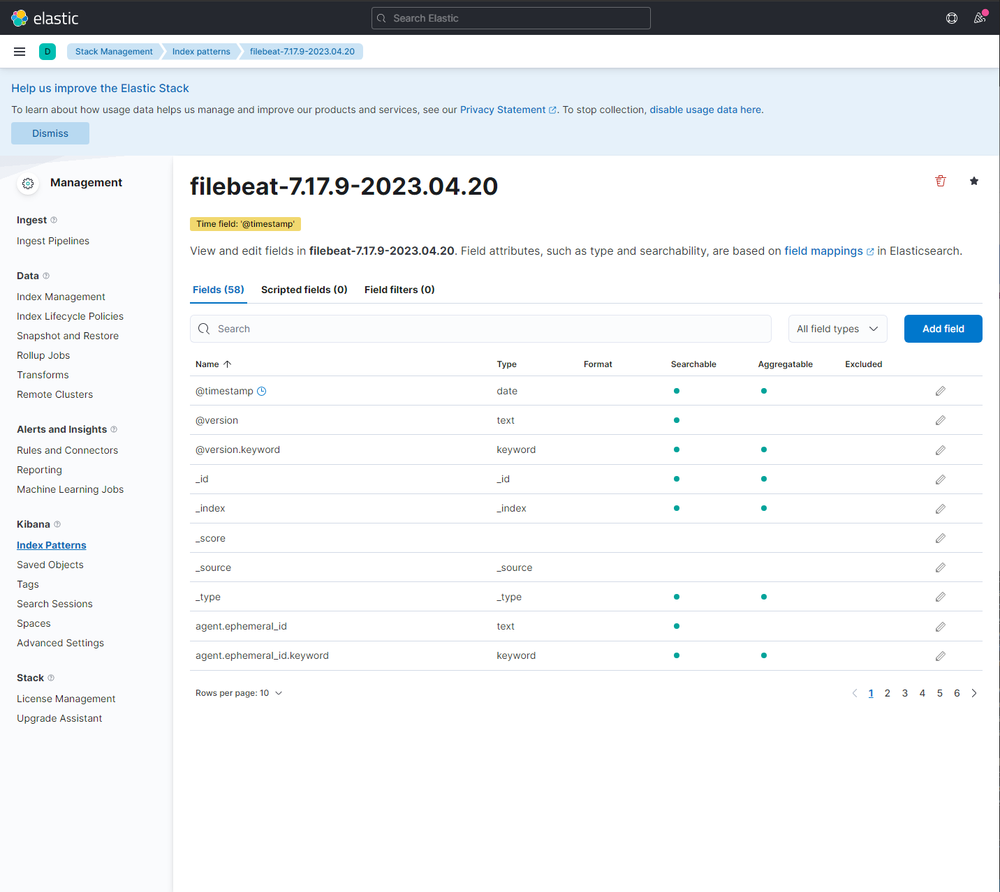
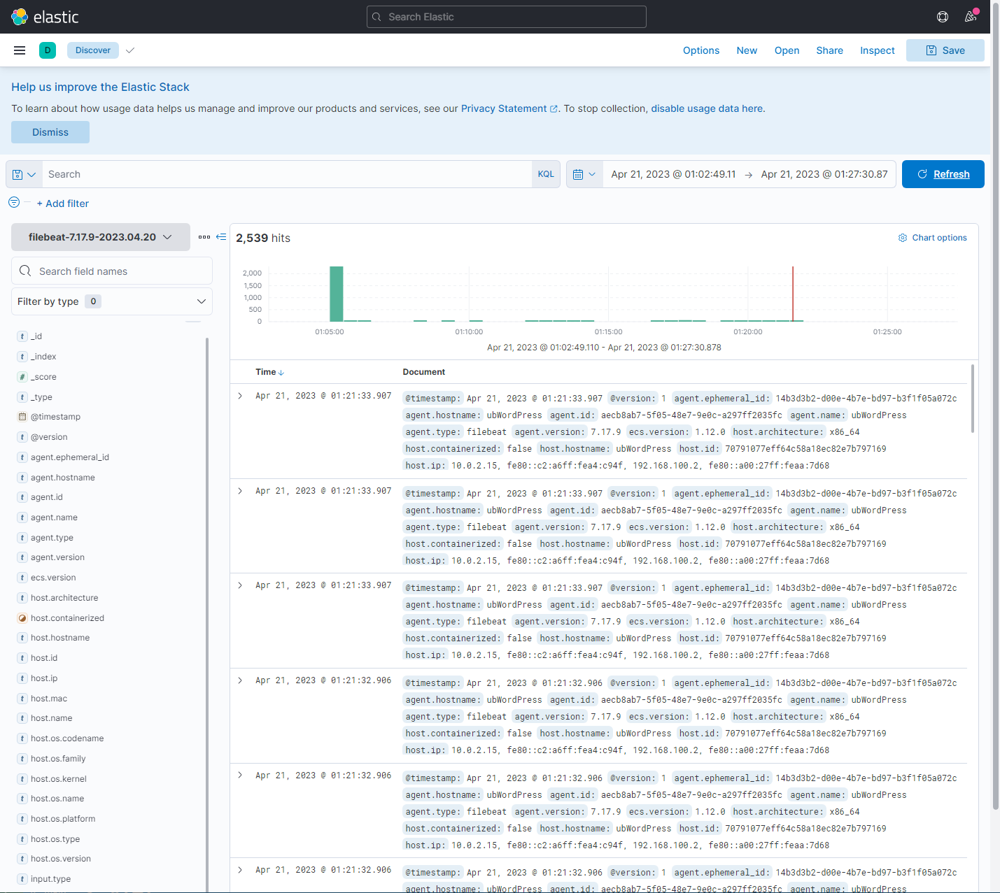

# sysadmin Alejandro-Moreno

## Agile SysAdmin: Networking and Systems Administration

Para arrancar las VMs se introduce en el directorio raiz (/) :

    vagrant up 

Se habra desplegado todos los recursos en ambas maquinas:

    VM1 ----> Wordpress + MariaDB + Filebeat + Nginx
    VM2 ----> Elasticsearch + Logstash + Kibana

Tras terminar su despligue se puede acceder a las siguientes URLs para acceder a estos servicios:

* http://localhost:8081 Para acceder a Wordpress. Se habra de completar un registro.
* http://localhost:8080 Para acceder a Kibana. En su primer acceso se habra de acceder con <code>kibanaadmin</code> y la contraseña en el fichero *.kibana*.

## Wordpress

## Kibana
Screenshots de evidencia de que llegan logs a Kibana:

